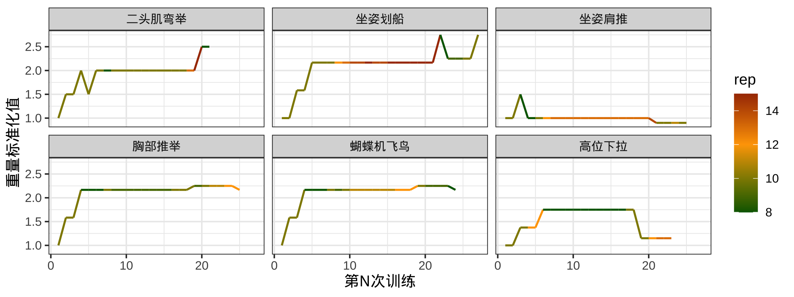

# README

减重如山倒，增肌如抽丝。2022年写博士毕业论文的一个月体重减少了两公斤，之后去德国两个月又减少了两公斤，之后体重维持平稳。为了恢复体重，之后断断续续健身和增加热量摄入，无果。2024年春末夏初终于开始认真健身，企图将摄入的热量固定下来。通常每周训练3次，重点训练胸肌和肩背。两大肌群各有3-4个动作，每次训练中，每个动作做3组，每组8-15个重复。健身开始至今，尝试了约20个动作，以固定器械为主，下面两图展示最常练的几个动作的重量变化。

