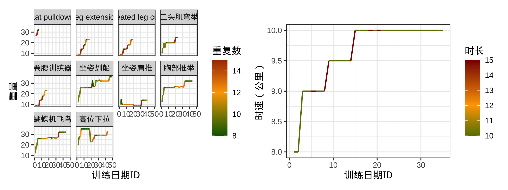
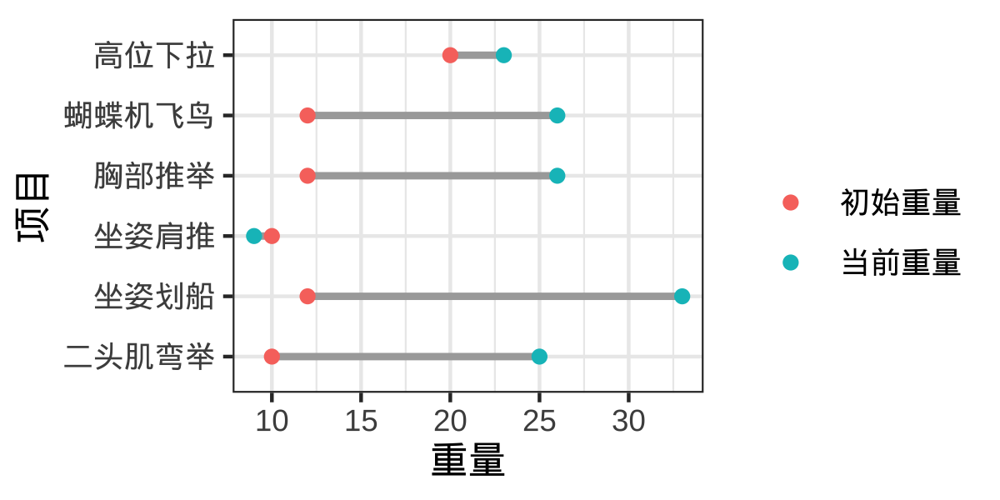

# README

减重如山倒，增肌如抽丝。2022年写博士毕业论文的一个月体重减少了两公斤，之后去德国两个月又减少了两公斤，之后体重维持平稳。为了恢复体重，之后断断续续健身和增加热量摄入，无果。2024年春末夏初终于开始认真健身，企图将摄入的热量固定下来。通常每周训练3次，重点训练胸肌和肩背。两大肌群各有3-4个动作，每次训练中，每个动作做3组，每组8-15个重复。健身开始至今，尝试了约20个动作，以固定器械为主，下面两图展示最常练的几个动作的重量变化。

    Attaching package: 'dplyr'

    The following objects are masked from 'package:stats':

        filter, lag

    The following objects are masked from 'package:base':

        intersect, setdiff, setequal, union

    Loading required package: sysfonts

    Loading required package: showtextdb

    ! Using an auto-discovered, cached token.

      To suppress this message, modify your code or options to clearly consent to
      the use of a cached token.

      See gargle's "Non-interactive auth" vignette for more details:

      <https://gargle.r-lib.org/articles/non-interactive-auth.html>

    ℹ The googlesheets4 package is using a cached token for
      'kangjiefeng37@gmail.com'.

    Auto-refreshing stale OAuth token.

    ✔ Reading from "饮食规划-叽嘎-瘦子增肌".

    ✔ Range ''训练内容'!A:F'.

    Warning: Using `size` aesthetic for lines was deprecated in ggplot2 3.4.0.
    ℹ Please use `linewidth` instead.

